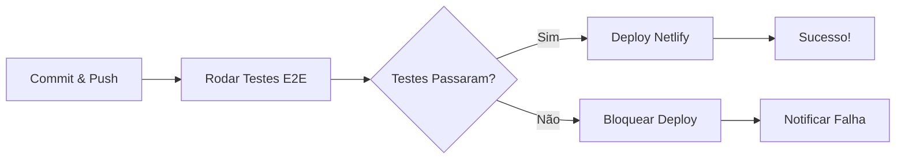

# 🔐 Configuração de CI/CD - GitHub Actions

## ✅ **O QUE FOI CONFIGURADO:**

### **3 Workflows Criados:**

1. **🧪 `playwright.yml`** - Testes E2E automáticos
   - Roda em: Push para `main` ou `develop`, Pull Requests
   - Executa: Todos os testes Playwright
   - Gera: Relatórios HTML, screenshots, vídeos

2. **🚀 `deploy.yml`** - Deploy para produção
   - Roda em: Push para `main`
   - Condição: **Só faz deploy se os testes passarem**
   - Deploy automático para Netlify

3. **🔍 `health-check.yml`** - Monitoramento diário
   - Roda em: Todo dia às 9h UTC (6h Brasília)
   - Execução manual disponível
   - Verifica se o app está funcionando

---

## 🔧 **CONFIGURAÇÃO NECESSÁRIA NO GITHUB:**

### **Passo 1: Adicionar Secrets**

Vá em: `GitHub → Seu Repositório → Settings → Secrets and variables → Actions`

Click em **"New repository secret"** e adicione:

#### **1. NETLIFY_AUTH_TOKEN**
```
Onde pegar:
1. Vá em https://app.netlify.com
2. User Settings → Applications → Personal access tokens
3. Click em "New access token"
4. Dê um nome: "GitHub Actions Deploy"
5. Copie o token gerado
6. Cole no GitHub Secret
```

#### **2. NETLIFY_SITE_ID**
```
Onde pegar:
1. Vá em https://app.netlify.com
2. Selecione seu site "Poderosa"
3. Site settings → General → Site information
4. Copie o "Site ID" (formato: xxxxxxxx-xxxx-xxxx-xxxx-xxxxxxxxxxxx)
5. Cole no GitHub Secret
```

---

## 🚀 **COMO USAR:**

### **Testes automáticos em cada commit:**
```bash
git add .
git commit -m "feat: nova funcionalidade"
git push origin main
```
👆 Isso vai:
1. ✅ Rodar todos os testes E2E
2. ✅ Gerar relatório com screenshots
3. ✅ Se passar, fazer deploy automático
4. ✅ Se falhar, bloquear deploy

### **Executar testes manualmente:**
1. Vá em: `GitHub → Actions → Testes E2E`
2. Click em "Run workflow"
3. Selecione a branch
4. Click em "Run workflow"

### **Ver relatórios:**
1. Vá em: `GitHub → Actions`
2. Click no workflow executado
3. Scroll até "Artifacts"
4. Download: `playwright-report` ou `test-results`

---

## 📊 **BADGES NO README:**

Já foram adicionados 3 badges no README.md:
- ✅ Status dos testes E2E
- ✅ Status do deploy
- ✅ Status do health check

Eles atualizam automaticamente mostrando:
- 🟢 Verde = Passou
- 🔴 Vermelho = Falhou
- 🟡 Amarelo = Executando

---

## 🔥 **FLUXO COMPLETO:**



---

## 🛠️ **CUSTOMIZAÇÕES OPCIONAIS:**

### **Adicionar notificações no Slack:**
```yaml
- name: Notify Slack
  if: failure()
  uses: 8398a7/action-slack@v3
  with:
    status: ${{ job.status }}
    webhook_url: ${{ secrets.SLACK_WEBHOOK }}
```

### **Rodar testes apenas em arquivos específicos:**
```yaml
- name: Rodar testes críticos
  run: npx playwright test tests/e2e/login.spec.js tests/e2e/cadastro.spec.js
```

### **Mudar horário do health check:**
```yaml
schedule:
  - cron: '0 12 * * *'  # Meio-dia UTC = 9h Brasília
```

---

## 📈 **MÉTRICAS QUE VOCÊ VAI TER:**

✅ **Histórico de execução** de todos os testes  
✅ **Screenshots automáticos** quando um teste falha  
✅ **Vídeos** da execução dos testes  
✅ **Relatórios HTML** bonitos e interativos  
✅ **Tempo de execução** de cada teste  
✅ **Taxa de sucesso** ao longo do tempo  

---

## 🎯 **PRÓXIMOS PASSOS:**

1. ✅ **Configure os secrets** no GitHub (NETLIFY_AUTH_TOKEN e NETLIFY_SITE_ID)
2. ✅ **Faça um commit** com os workflows criados
3. ✅ **Veja a mágica acontecer** nos Actions do GitHub
4. ✅ **Acompanhe os badges** no README

---

## 🆘 **TROUBLESHOOTING:**

### **Problema: Deploy falhou com erro 401**
**Solução:** Verifique se o NETLIFY_AUTH_TOKEN está correto

### **Problema: Testes não rodam**
**Solução:** Certifique-se de que `package.json` tem `@playwright/test` nas dependencies

### **Problema: Health check sempre falha**
**Solução:** Ajuste a BASE_URL no workflow para apontar para seu domínio real

---

**🎉 PARABÉNS! CI/CD configurado com sucesso!**
